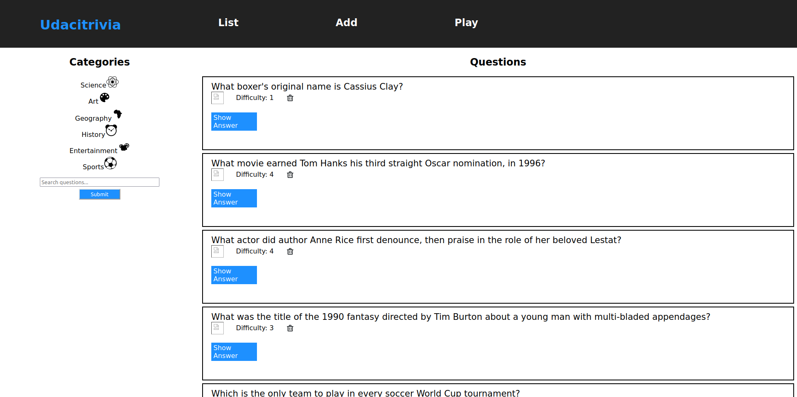

# Udacitrivia



## Introduction

Udacitrivia is a trivia game used in creating bonding experiences between employees and students. Both play against each other and find out who's the most knowledgeable of the bunch. The app can;

1. Display questions to be answered - both all questions and by category. A question has a category it's in, the question and difficulty rating and a toggle to show/hide the answer.
2. Delete questions.
3. Add questions by providing the question text, answer, category and difficulty.
4. Search for questions based on a text query string.
5. Allow play, randomizing either all questions or within a specific category.

## Getting Started

### Frontend Setup

1. **NodeJS**: \
https://nodejs.org/en/download/package-manager/ 
2. **NodeJS dependencies**: \
`npm install` 
3. Start app: \
`npm start` 

### Backend Setup

1. **Python 3.7** - Follow instructions to install the latest version of python for your platform in the [python docs](https://docs.python.org/3/using/unix.html#getting-and-installing-the-latest-version-of-python)


2. **Virtual Enviornment** - Instructions for setting up a virual enviornment for your platform can be found in the [python docs](https://packaging.python.org/guides/installing-using-pip-and-virtual-environments/)


3. **PIP Dependencies** - Once you have your virtual environment setup and running, install dependencies by running:
```bash
pip install -r requirements.txt
```
This will install all of the required packages we selected within the `requirements.txt` file.

4. **Key Dependencies**
 - [Flask](http://flask.pocoo.org/)  is a lightweight backend microservices framework. Flask is required to handle requests and responses.

 - [SQLAlchemy](https://www.sqlalchemy.org/) is a Python SQL toolkit and ORM.

 - [Flask-CORS](https://flask-cors.readthedocs.io/en/latest/#) is the extension used to handle cross origin requests from the frontend server. 

### Database Setup
With Postgres running, restore a database using the trivia.psql file provided. From the backend folder in terminal run:
```bash
psql trivia < trivia.psql
```

### Tests

Tests can be run from the backend folder

`python test_flaskr.py`

### API Reference
https://github.com/ENOCKMOSETI/Udacity-Udacitrivia/blob/trunk/backend/README.md

### Authors
Enock Moseti

### Acknowledgements
Udacity
African Leadership X